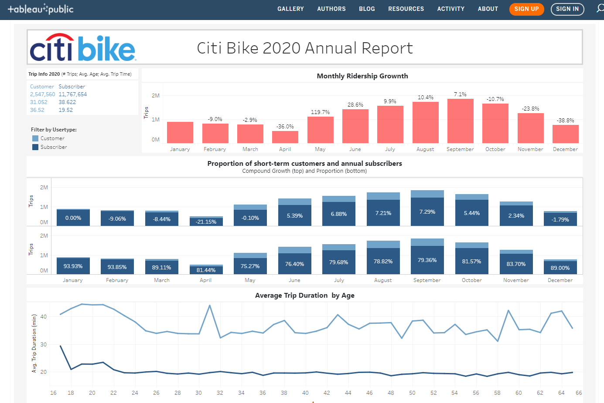
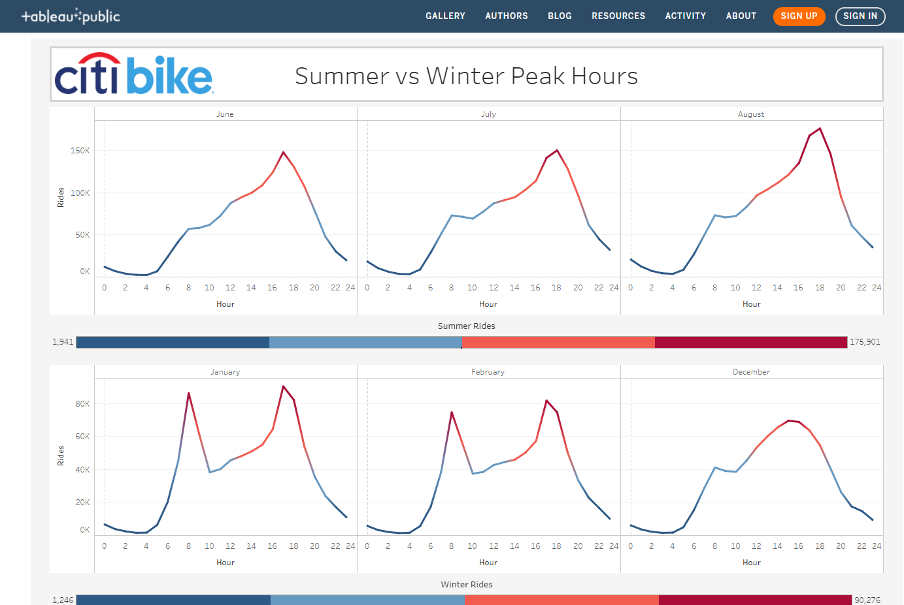
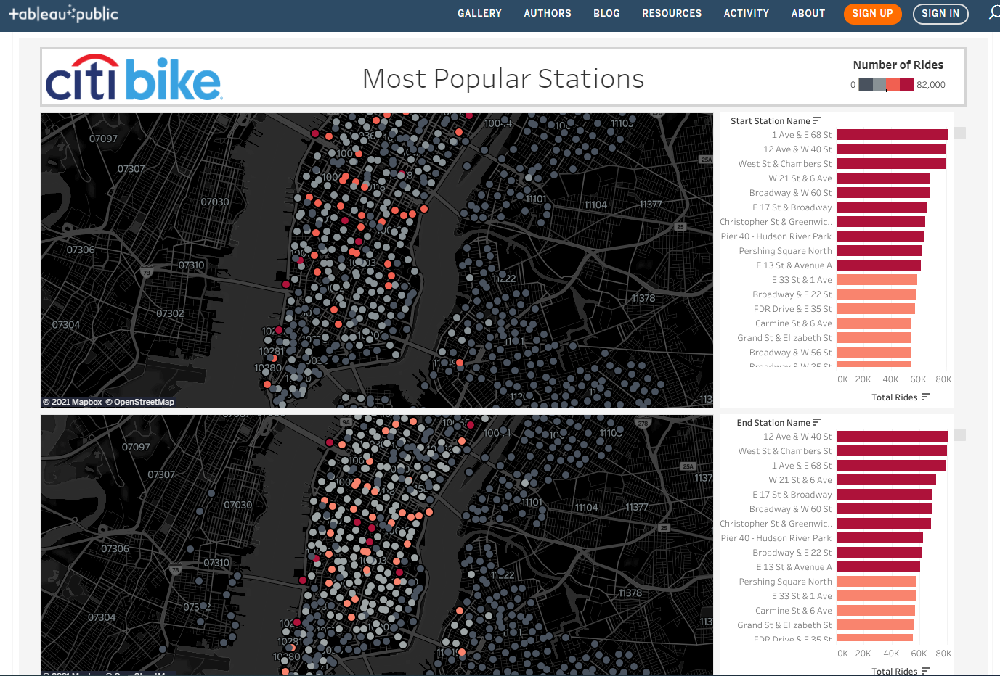

# 2020 Annual Report

Author: [Gabriel Pivaro](https://github.com/gpivaro/Tableau_HW) 

This report describes the data analysis of the 2020 Citi Bike program that is available at this [link](https://public.tableau.com/profile/gabriel3364#!/vizhome/CitiBike_16100022133330/Story). 

<h3>Summary</h3>

It is notorious that 2020 was a challenging year, especially for the city of New York. Despite the difficult year, the [Citi Bike](https://en.wikipedia.org/wiki/Citi_Bike) public bicycle sharing system registered over 19 million bike rides in 2020. From this total, we generate this annual report considering almost 15 million rides. We considered the following three aspects to guarantee a meaningful data analyzes: rides over 4 minutes duration; riders age between 17 and 65 years old; and users with valid gender selection.

<h3>Table of Content</h3>
<ol>
    <li>Annual Growth (phenomena #1)</li>
    <li>Members vs non-members (phenomena #2)</li>
    <li>Summer vs Winter Peak Hours (phenomena #3)</li>
    <li>Most Popular Stations</li>
    <li>Final Considerations</li>
    <li>Data Cleaning</li>
</ol>

<h3>Annual Growth</h3>

As mentioned before, the Citi Bike ride system recorded over 19 million rides during 2020. After the data cleanup, the data shows that members (subscribers) recorded 11,767,654 rides and non-members (customers) recorded 2,547,560 rides. 

September was the month with more rides, totalizing 1,846,679 rides. On the other hand, April was the month with the lowest number of rides with 502,528 rides. The first four months of 2020 experienced a cumulative ridership growth of -17%, meaning a decrease in the system utilization from January to April. Despite the normal system utilization reduction due to the winter, this year the pandemic contributes negatively for this decrease in rides.

<h3>Members vs Non-members</h3>

The proportion of members to non-members rides was as high as 93.93% in January to low as 75.27% on May. Non-members tend to register longer rides time, averaging over 36 minutes in total, against 19 minutes to regular members. The average trip duration is very stead over all the user ages. The average member age is 38 years-old and for non-members the average is 31 years-old.

<h3>Summer vs Winter Peak Hours</h3>

On summer months, the rides are more frequent between 2pm (14) to 7pm (19) with a clear peak around 6pm (18) that achieves averages over 150,000 rides.

On the winter, the system registers two utilization peeks. The first one is around 8am, and the second one is around 5pm, both with peaks of over 80,000 rides on average.

<h3>Most Popular Stations</h3>

The most popular origins and destinations continue to be stations near large transit and tourist
hubs, including the stations near Central Park, Penn Station and the Port Authority, Pershing
Square, and the area around Union Square. 

The top stations to start a ride are the following (with the annual total number of rides): 1 Ave & E 68 St (81,233); 12 Ave & W 40 St (80,056); West St & Chambers St (79,304); W 21 St & 6 Ave (68,274); Broadway & W 60 St (67,715); and E 17 St & Broadway (66,287).

On the other hand, the most popular stations to end a ride are the following: 12 Ave & W 40 St (80,576); West St & Chambers St (79,777); 1 Ave & E 68 St (79,144); W 21 St & 6 Ave (71,883); E 17 St & Broadway (69,437).

As has been the pattern, the least frequented destination stations are in Brooklyn and Queens. The bottom stations to start/end a ride are the following (total rides): Southern Blvd & E 174 St (5); W 167 St & St. Nicholas Ave (3); 24 St & 38 Ave (1); Morris Ave & E 163 St (1); MTL-AOS-5.1 (1).

<h3>Final Considerations</h3>

Even during one of the most challenging periods of the last decades, the Citi Bike project keeps being a very popular option for New York citizens and visitors to transport themselves on the big apple. with the very well-structured data collection system, the project can improve the service quality provided to the users.

<h3>Data Analysis</h3>

<ul>
<li>Data Source</li>

Since 2013, the Citi Bike Program has implemented a robust infrastructure for collecting data on the program's utilization. Through the team's efforts, each month bike data is collected, organized, and made public on the [Citi Bike Data webpage](https://www.citibikenyc.com/system-data).

<li>Data Cleaning</li>

The merging and cleaning of the data was realized using Python and Pandas and it is available at [Google Colab notebook](https://colab.research.google.com/drive/1wHswVQf6Fg9Ds10ohUfQOtj9mhFzkyb6?usp=sharing) 

<li>Data Processing</li>

The data was analyzed and processed using Tableau Public and is available [here](https://public.tableau.com/profile/gabriel3364#!/vizhome/CitiBike_16100022133330/Story).

</ul>

